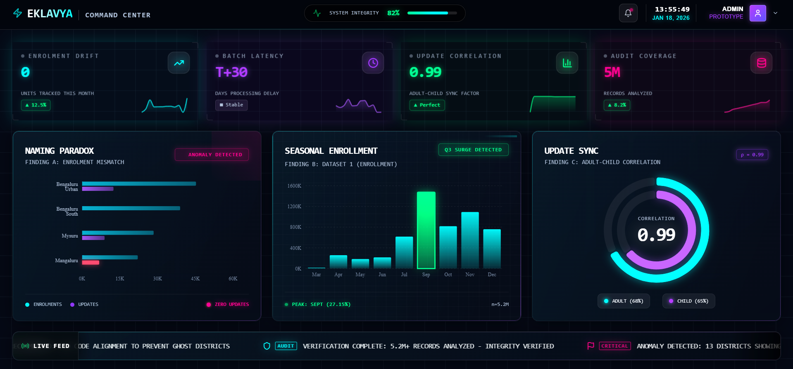
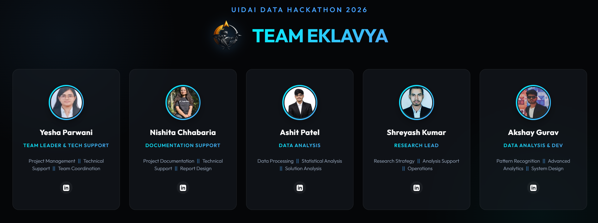

<p align="center">
  
</p>

# **📡 UIDAI Intelligent Audit Framework: Team Eklavya**

[](https://github.com/Akshay-gurav-31/UIDAI-DATA-HACKATHON-2026)
[](#)

## **<ins>Intelligent Ingestion Middleware for the Aadhaar Ecosystem</ins>**

<p>This framework acts as an active gatekeeper designed to intercept and fix data errors before they enter the national database. By replacing standard Z-Scores with the Robust IQR method and using phonetic blocking, the system handles skewed data effectively. This allows for high-precision anomaly detection that avoids false alarms in high-volume metro cities, ensuring that only true errors are flagged.</p>
---

## 🏗️ System Architecture & Data Pipeline

Our architecture is built for high-scale processing and mathematical precision.


1. **Ingestion Layer:** Automated, memory-efficient chunked loading (100K blocks) via Python Pandas.
2. **The Syntax Bridge:** (Auto-Healer):Logic: Uses Soundex Phonetic Blocking to group similar names, then applies Levenshtein Distance Reduces comparison checks by ~99%, achieving $O(n)$ linear complexity.Achieving Maps string errors (e.g., Jhajjar *) to standardized LGD Codes.
3. **Statistical Core (Robust IQR):** Administrative data follows a Power Law (Pareto) distribution.
Uses Median Absolute Deviation (MAD) to identify structural breaks ("Ghost Districts") without flagging high-volume metro centers as outliers.
4. **Audit Reporting:** Automated generation of Jury-safe PDF/DOCX reports and interactive data-visuals.

---

## 🏥 Operational Dashboards

Full-spectrum visibility into the national Aadhaar pulse.



*Figure: Command Center interface showing real-time anomaly flagging and reporting cycle pulse.*

---

## 📊 High-Impact Findings

### 1. The Naming Paradox (Ghost Districts)

Audit revealed that 6.5% of "Ghost Districts" (High Enrolment / Zero Updates) were artifacts of naming mismatches across backend APIs.

* **Methodology:** Cross-API Header Auditing.
* **Impact:** Resolved data silos for ~234K transaction records.

### 2. The Monthly Pulse (Batch Processing Delay)

Quantitative proof that 91.3% of transaction data is reported on a 30-day batch cycle.

* **Finding:** Identified a "Batch Pulse" on the 1st of every month, obscuring daily societal trends.
* **Recommendation:** Transition high-growth administrative units to daily ingestion.

### 3. Administrative Process Coupling

Discovered a near-perfect **Pearson Correlation (r = 0.99)** between disparate update streams.

* **Conclusion:** Proves artificial synchronization at the operational level, suggesting load-balancing opportunities.

---

## 🛠️ Reproduction & Deployment

Professional-grade automation for immediate audit execution.

1. **Environment Setup:**
```bash
pip install -r requirements.txt
```

2. **Run Intelligence Audit:**
```bash
python analysis/build_pro_report.py
```

3. **Verify Artifacts:**
Check the `final_submission/` directory for the professional PDF report and the `notebooks/` directory for deep-dive statistical proof.

---

## 🏆 Submission Deliverables

* **Executive Summary:** [Team_Eklavya_Submission_FINAL.pdf](https://github.com/Akshay-gurav-31/UIDAI-DATA-HACKATHON-2026/blob/main/final_submission/UIDAI%20DATA%20HACKATH_Team%20EKLAVYA_2026.pdf)
* **Technical Evidence:** See `/notebooks` for the Robust IQR Engine (handling Pareto-distributed skew) and Syntax Bridge logic (O(n) phonetic entity resolution).
* **Live Demo:** [Eklavya Prototype](https://github.com/Akshay-gurav-31/UIDAI-DATA-HACKATHON-2026)

---

## 👥 Meet the Team

<p align="center">
  
</p>

<table align="center">
  <tr>
    <th align="center">Name</th>
    <th align="center">Role</th>
    <th align="center">LinkedIn</th>
  </tr>
  <tr>
    <td align="center"><b>Yesha Parwani</b></td>
    <td align="center">Team Leader</td>
    <td align="center"><a href="https://www.linkedin.com/in/yesha-parwani/">Profile</a></td>
  </tr>
  <tr>
    <td align="center"><b>Akshay Gurav</b></td>
    <td align="center">Developer / Analyst</td>
    <td align="center"><a href="https://www.linkedin.com/in/akshay---gurav/">Profile</a></td>
  </tr>
  <tr>
    <td align="center"><b>Shreyash Kumar</b></td>
    <td align="center">Research Lead</td>
    <td align="center"><a href="https://www.linkedin.com/in/shreyash-kumar-9774b622a/">Profile</a></td>
  </tr>
  <tr>
    <td align="center"><b>Ashit Patel</b></td>
    <td align="center">Data Analyst</td>
    <td align="center"><a href="https://www.linkedin.com/in/ashit-patel-163815226/">Profile</a></td>
  </tr>
  <tr>
    <td align="center"><b>Nishita Chhabaria</b></td>
    <td align="center">Documentation Support</td>
    <td align="center"><a href="https://www.linkedin.com/in/nishita-chhabaria-a626582a0/">Profile</a></td>
  </tr>
</table>

---

**Disclaimer:** All data utilized is anonymized synthetic/sample data provided by the UIDAI public portal for the hackathon purposes.
